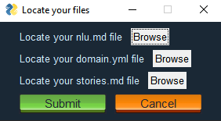
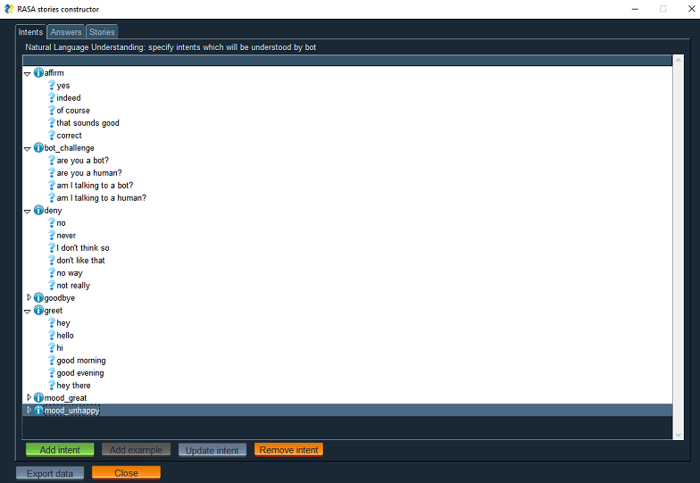
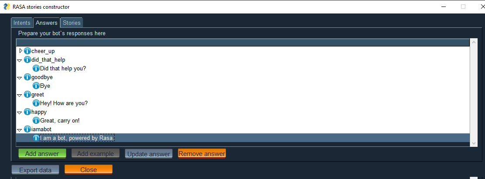
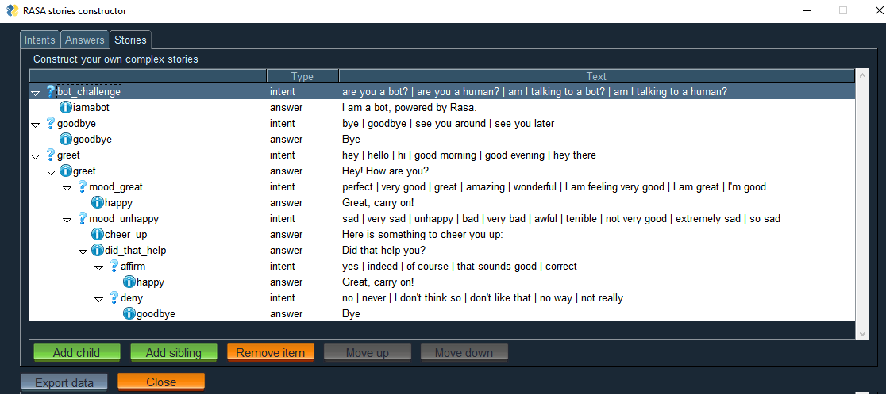
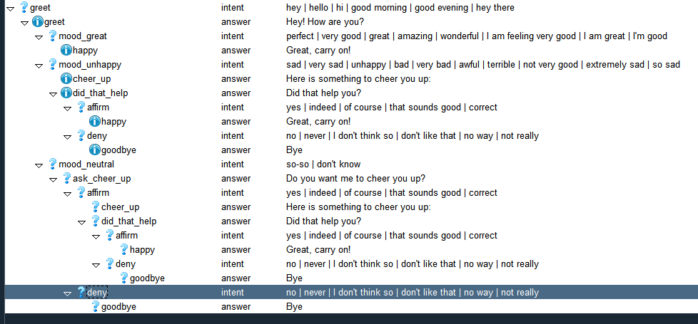

# RASA storyteller

When working with wonderful library [Rasa Open Source](https://github.com/RasaHQ/rasa) it is rather difficult to create complex stories, especially for people who are not familiar with YAML / Markdown.  
This project is a small tool, which helps to make complex stories with lots of negative paths faster.
The goal of this project is to help non-technical stuff edit bot's behaviour easily. 

## Installation
Install package using pip: `pip install rasa-storyteller` and launch `rasa-storyteller`

## How to use it

Let's start a new RASA project in a usual way:
```
$ rasa init
Welcome to Rasa! 🤖

To get started quickly, an initial project will be created.
If you need some help, check out the documentation at https://rasa.com/docs/rasa.
Now let's start! 👇🏽

? Please enter a path where the project will be created [default: current directory] .
Created project directory at '/home/user/rasa-project'.
Finished creating project structure.
? Do you want to train an initial model? 💪🏽  No
No problem 👍🏼. You can also train a model later by going to the project directory and running 'rasa train'.
```

After that we should go to the directory with our new project and find three files: `domain.yml`, `data/nlu.md`, `stories.md`.
Launch our utility and locate those files in the start window:    

  
After you load those files a main window with three tabs opens, they are:

 - intents:  
      
  You can easily add new intents or new nlu examples, update or remove existing intents in this window.
    
 - responses:  
      
  Using this window you can do CRUD operations with responses.

 - stories:  
      
  The most interesting tab: here stories are presented as trees. You can link your intents with answers or even create new intent/response in-place using right button menu.
  
  When you have created some story with complex logic and multiple branchings like this:  
       
  
  Just press "export" button at the bottom of the window and `domain.yml`, `data/nlu.md`, `stories.md` will be generated in `<your_working_directory>/export/`. 
  They will be suffixed with current timestamp so you can push "export" multiple times while editing to store different versions.
  The stories generated from image above will look like this:
  
  ```
    ## greet-mood_great
    * greet
        - utter_greet
    * mood_great
        - utter_happy
    
    ## greet-mood_unhappy-affirm
    * greet
        - utter_greet
    * mood_unhappy
        - utter_cheer_up
        - utter_did_that_help
    * affirm
        - utter_happy
    
    ## greet-mood_unhappy-deny
    * greet
        - utter_greet
    * mood_unhappy
        - utter_cheer_up
        - utter_did_that_help
    * deny
        - utter_goodbye
        
    ## greet-mood_neutral-deny
    * greet
        - utter_greet
    * mood_neutral
        - utter_ask_cheer_up
    * deny
        - utter_goodbye
    
    ## greet-mood_neutral-affirm-affirm
    * greet
        - utter_greet
    * mood_neutral
        - utter_ask_cheer_up
    * affirm
        - utter_cheer_up
        - utter_did_that_help
    * affirm
        - utter_happy
    
    ## greet-mood_neutral-affirm-deny
    * greet
        - utter_greet
    * mood_neutral
        - utter_ask_cheer_up
    * affirm
        - utter_cheer_up
        - utter_did_that_help
    * deny
        - utter_goodbye
    ```